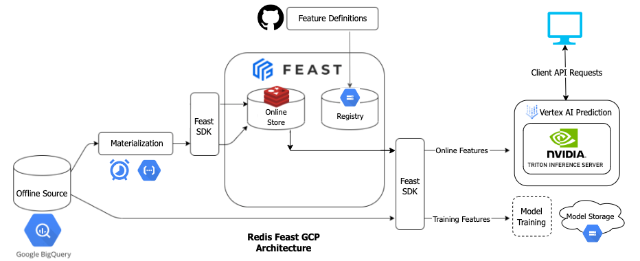
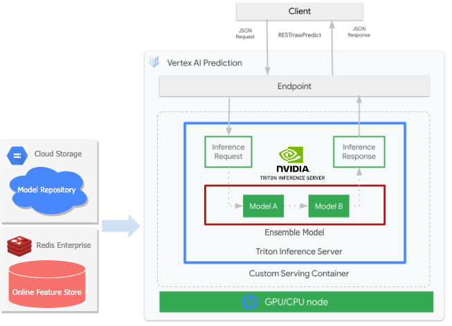

# redis-feast-triton-gcp
*An end-to-end machine learning feature store reference architecture using [Feast](https://docs.feast.dev/) and [Redis Enterprise](https://app.redislabs.com/) (as the Online Feature Store) deployed on [Google Cloud Platform](https://cloud.google.com/).*

>This prototype is a reference architecture. All components are containerized, and various customizations and optimizations might be required before running in production for your specific use case.
___

## Demo ML Application: COVID-19 Vaccination Forecasting
To demonstrate the value of a Feature Store, we provide a demo application that **forecasts the counts of administered COVID-19 vaccine doses** (by US state) **for the next week**.

The Feature Store fuses together weekly [google search trends data](https://console.cloud.google.com/marketplace/product/bigquery-public-datasets/covid19-vaccination-search-insights) along with lagging [vaccine dose counts](https://github.com/owid/covid-19-data). *Both datasets are open source and provided free to the public.*

The full system will include:
- GCP infrastructure setup and teardown
- Offline (BigQuery) and Online (Redis Enterprise) Feature Stores using Feast
- Model serving in Vertex AI + NVIDIA Triton Inference Server

### Reference Architecture



The architecture takes advantage of GCP managed services in combination with Feast and Redis.

- **Feast** feature definitions in a **GitHub** repository (here).
- Feature registry persisted in a **Cloud Storage** bucket with **Feast** and *COMING SOON* **Cloud Build** for CI/CD.
- Offline feature data stored in **BigQuery** as the source of record.
- Daily **Cloud Scheduler** tasks to trigger a materialization **Cloud Function** that will migrate the latest feature updates to the Online feature store.
- Model serving with **Vertex AI Prediction** using a custom **NVIDIA Triton Inference Server** container.
- Online feature retrieval from **Redis** (low latency) with **Feast**.

By the end of this tutorial, you will have all components running in your GCP project.

___

## Getting Started
The demo contains several smaller apps organized by Docker Compose. Below we will cover prereq's and setup tasks.

### Prerequisites

#### Docker
Install Docker on your machine. [Docker Desktop](https://www.docker.com/products/docker-desktop/) is best, thanks to it's ease of use, in our opinion.

#### ☁️ GCP

#### GCP Account Setup

In order to run this in Google Cloud, you will need a GCP project. The steps are

1. If you don't have one [create a new GCP project](https://console.cloud.google.com/cloud-resource-manager)
2. [Make sure that billing is enabled for your project.](https://cloud.google.com/billing/docs/how-to/modify-project)
3. Acquire a GCP service account credential file and download to your machine, somewhere safe.
    - IAM -> Service Account -> Create service account

4. Create a new key for that service account.
    - In Service account, go to "keys" pane and create new key.
    - Download locally and remember the file path:

        


#### Redis Cloud
Setup a [Redis Cloud instance](https://app.redislabs.com/) and record the public endpoint `{host}:{port}` and password. **There's a 30Mb Free Tier** which will be perfect for this demo.

#### Environment
This demo provisions GCP infrastructure from your localhost. So, we need to handle local environment variables, thankfully all handled by Docker and a `.env` file.


Make the env file and enter values as prompted. See template below:
```bash
$ make env
```
>REDIS_CONNECTION_STRING={host}:{port}

>REDIS_PASSWORD={password}

>GOOGLE_APPLICATION_CREDENTIALS={local-path-to-gcp-creds}

>PROJECT_ID={gcp-project-id} **(project-id NOT project-number)**

>GCP_REGION={preferred-gcp-region}

>BUCKET_NAME={your-gcp-bucket-name} **(must be globally unique)**

>SERVICE_ACCOUNT_EMAIL={your-gcp-svc-account-email}


#### Build Containers
Assuming all above steps are done, build the docker images required to run the different setup steps.

From the root of the project, run:
```bash
$ make docker
```

**TIP**: Disable docker buildkit for Mac machines (if you have trouble with this step)

```bash
export DOCKER_BUILDKIT=0
```

The script will build a [base Docker image](./Dockerfile) and then build separate images for each setup step: [`setup`](setup/) and [`jupyter`](jupyter/). 

>This will take some time, so grab a cup of coffee.

### Infra Setup
The provided [Makefile](./Makefile) wraps bash and Docker commands to make it super easy to run. This particular step:
- Provisions GCP infrastructure
- Generates the feature store
- Deploys the model with Triton Inference Server on Vertex AI

```bash
$ make setup
```
>At the completion of this step, most of the architecture above will be deployed in your GCP project.

#### About Triton on Vertex AI

As noted above, Vertex AI allows you to [deploy a custom serving container](https://cloud.google.com/vertex-ai/docs/predictions/use-custom-container) as long as it meets specific baseline requirements. This allows us to use one of our favorite serving frameworks: NVIDIA's [Triton Inference Server](https://developer.nvidia.com/nvidia-triton-inference-server). NVIDIA and GCP already did the legwork to integrate their products so that we can use them together:



A Triton ensemble model can be served with Vertex AI and leverage Redis and Feast for low latency feature retrieval, combining the best in class hardware and software to serve models in real time.

___

### Other Components
Now that the Feature Store is in place, utilize the following add-ons to perform different tasks as desired.

#### Jupyter Notebooks
This repo provides several helper/tutorial notebooks for working with Feast, Redis, and GCP. Open a Jupyter session to explore these resources:

```bash
$ make jupyter
```

#### Teardown
Cleanup GCP infrastructure and teardown Feature Store.

```bash
$ make teardown
```

### Cleanup
Besides running the teardown container, you can run `docker compose down` periodically after shutting down containers to clean up excess networks and unused Docker artifacts.

___
